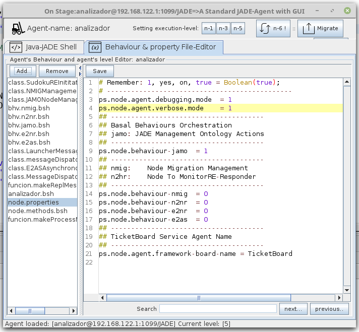
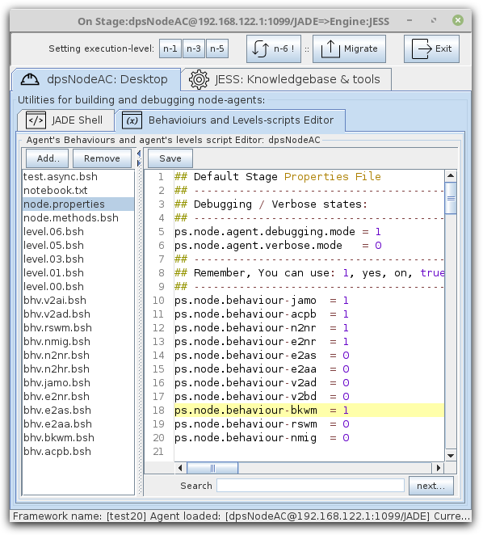
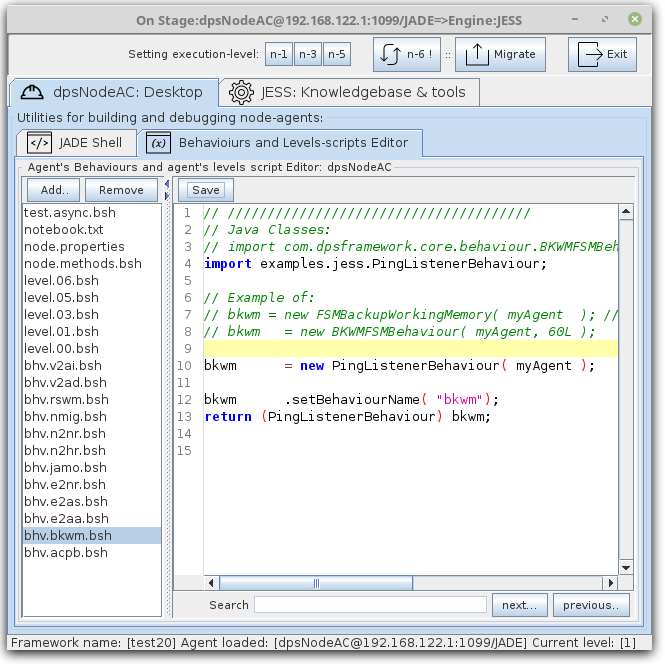
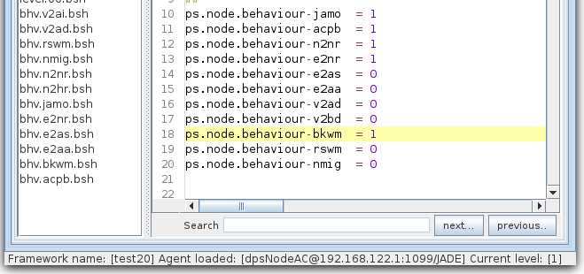
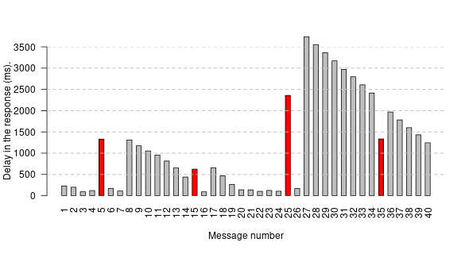
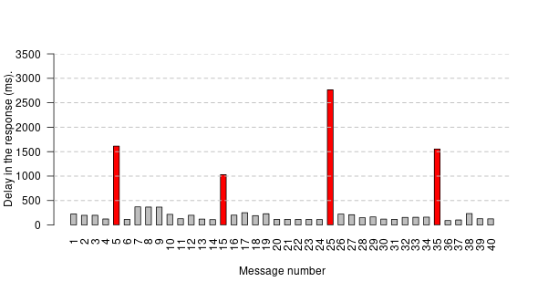

# Instructions for reproducing the comparative study included in the paper


> Paper: **Middleware-based multi-agent development environment for building and testing distributed intelligent systems**


****

### Summary

These are the steps required to perform the first comparative analysis from operating system console and agent console. For subsequent analysis, it is only necessary to reproduce steps nine through fourteen.


| Phase                  | Process detail                                          |
|:---------------------  |:--------------------------                              |
| 1. Download dpsFramework  |  `$   wget  https://github.com/dpsframework/dpsFrameworkBuilder/releases/download/1.8/dpsFrameworkBuilder-full-1.8.jar` [[3]](#3) |
| 2. Make new JADE project  <br /> named `test20`    |  `$   java -jar dpsFrameworkBuilder-full-1.8.jar --new=test20`  |
| 3. Clone this repository             |  `$   git clone https://github.com/pacoaguayo/HLCjessAgent`  |
| 4. Setting JDK JAVA CLASSPATH             |  `$ export CLASSPATH=lib/*:`    |
| 5. Deploy first time <br /> agents on JADE <br /> and close it             | 5.1.- `$ cd test20`  <br />  5.2.- `$  cp  ../HLCjessAgent/startUp.sh  .` <br /> 5.3.- `$ ./startUp.sh`  <br /> 5.4.- Close with: `RMA JADE Agent GUI, <File>-<Shut down Agent platform>`    |
| 6. Combine directories on `test20` |  `$   cp -a ../HLCjessAgent/* . `   |
| 7. Compile library `jessAgent` (optional)  |  `$  ant dist `  |
| 8. Deploy again JADE              |  `$ ./startUp.sh`     |
| 9. Launch benchmarking  <br /> of `hlc400` agent    |  `[nodeName]://analizador/config/# >  analizador( "hlc400", 4 );` <br /> Please, wait 12 seconds to finish analysis. |
| 10. Harvest `hlc400` .csv  <br /> rows dataset      |  `[nodeName]://analizador/config/# >  md();`  <br /> Pick with mouse last 40th rows.   |
| 11. Setting `dpsNodeAC` run-level    |   `[nodeName]://dpsNodeAC/config/# >  init(5);`  <br /> or <br /> `clik on buttom 5`     |
| 12. Launch benchmarking  <br /> of `dpsNodeAC`       |   `[nodeName]://analizador/config/# >  analizador( "dpsNodeAC", 4 );`  <br /> 12 seconds waiting...    |
| 13. Harvest `dpdsNodeAC`  <br /> .csv rows dataset  |   `[nodeName]://analizador/config/# >  md();`  <br /> And, pick with mouse last 40th rows.   |
| 14. Obtain `barplot`  <br />   |   See: ` Appendix: Barplot graphics with R scripts`     |

  **Table.1**: Process by Phases in: Operating System-Shell **($)**, and Agent-Shell **([nodeName]://../#)**.  
  
  
  
****


>  **NOTE**: 
>  The following paragraphs are a detailed description of the steps described in **Table.1**.
That description is for your information. 
All that changes inside property files are included in this repository. 
So when the **HLCjessAgent repository** and **test20 dpsFramework** directory are combined in step 6, the properties of agents (**hlc400@**) and (**dpsNodeAC@**) are ready to start the analysis.


> The parameters of the analysis as a whole can be modified according to your consideration.
This can be done by altering the values ​​of lines 698 to 705 of the `nodes/analizador/analizador.bsh` file written in JAVA language and interpreted by BeanShell in the agent.
As always, these kinds of changes require closing the (**analizador@**) agent and launching it again with `$ java launcher monitor localhost analizador &`.


****


| Institution:  | Project:   | 
|:--------------------------------- |:--------------------- |
|  <br /> **Department:** <br />  Electrical and Systems Engineering, and Automation  <br /> **University of León** [[9]](#9) |  **Objective**: Statistical Analysis Addenda <br /> **Article type**: Regular Article <br /> **Document title**: Middleware-based multi-agent development environment for building and  testing distributed intelligent systems <br /> **Keywords:** Rule-based agent; Multi-Agent Systems; distributed intelligence; development environment. <br /> **Status**: Finished <br />  **Order of Authors**:   Francisco José Aguayo-Canela, Ph.D. <br /> Héctor Alaiz-Moretón, Ph.D. <br /> María Teresa García-Ordás, Ph.D. <br /> José Alberto Benítez-Andrades, Ph.D. <br /> Carmen Benavides, Ph.D. <br /> Isaías García-Rodríguez, Ph.D.   <br /> **Abstract**:  The spread of the Internet of Things (IoT) is demanding new, powerful architectures for handling the huge amounts of data produced by the IoT devices. In many scenarios, many existing isolated solutions applied to IoT devices use a set of rules to detect, report and mitigate malware activities or threats. This paper describes a development environment that allows the programming and debugging of such rule-based multi-agent solutions. The solution consists in the integration of a rule engine into the agent, the use of a specialized, wrapping agent class with a graphical user interface for programming and testing purposes, and a mechanism for the incremental composition of behaviors. Finally, a set of examples and a comparative study were accomplished to test the suitability and validity of the approach. The JADE multi-agent middleware has been used for the practical implementation of the approach.   | 


# Code & examples


## 1. Introduction

- The _JAVA-BeanShell_ [[1]](#1) and the _JADE Platform_ multi-agent system [[7]](#7) have been used to make this comparative analysis between agents.

- The main objective has been to compare and quantify how two different solutions dedicated to integrating a rules engine affect performance. Both agents use the _JESS_ [[5](#5)] rule-based engine.

- The compared agents are two. First agent named (**hlc400@**) belongs to HLCjessAgent class. That  class --expanded for this experiment-- complies with the improvement proposals made by _Cardoso, H.L._ [[4]](#4) to update the _JessAgent_ agent developed by  _Bellifemine, F. and Kamyab, K._ [[2]](#2) and [[6]](#6).


- Second agent named (**dpsNodeAC@**) is built by _dpsNodeAgent_ class. That kind of agent is our proposal to integrate rule-based engine (JESS or CLIPS technologies) inside JADE agents and it was developed at Universtity of León, Spain [[3]](#3).


## 2. Deploy and configure the environment

- Download from GitHub the 1.8 full version of _DpsFrameworkBuilder_ software  [[3]](#3).
- Make a new _DpsFramework_ JADE Project named `test20`.
- Copy and combine the files from this GitHub repository over (`test20`) directory project.


### 2.1. How to make a new JADE Agent-project and adjusting JAVA environment

These statements can be used to build new JADE agent project.

```{.bash     caption="How to generate a Test-Environment"}
$ cd ~/tmp/
$ mkdir testEnv
$ cd testEnv/                        ## Download DpsFramework here [3].

$ java -version
$ sudo alternatives --config java    ## =< v11.0.4+11-LTS (Oracle)

$ java -version
    openjdk version "1.8.0_252"      ## Nota: JDK-1.8.x, is enough.
    OpenJDK Runtime Environment (build 1.8.0_252-b09)
    OpenJDK Server VM (build 25.252-b09, mixed mode)
    
$ java -jar dpsFrameworkBuilder-full-1.8.jar --new=test20
```

### 2.2. Testing `test20` project development environment capabilities

From same terminal: 

```{.bash    caption="Test environment"}
$ cd test20/
$ echo $CLASSPATH
$ export CLASSPATH=lib/*:

$ java shell
$ java shell jess                    ## Exit with (exit)
$ java shell java                    ## Exit with System.exit(0);
$ java launcher stage-node localhost dpsNodeAC Jess 4455
```


### 2.3. Copy and combine this GitHub project on `test20` directory

It is possible to use the script _startUp.sh_ from console over `test20` directory. So, it is necessary to clone this repository first.


```{.bash   caption="Deploy the three agents: analyzer, hlc400 and dpsNodeAC"}
$  cd ..    (go to test' father: `testEnv/.`).
$  git clone https://github.com/pacoaguayo/HLCjessAgent
$  cd test20
$  cp ../HLCjessAgent/startUp.sh .
$ ./startUp.sh
```


That file (`startUp.sh`) contains:


```{.bash    caption="Deploy the three agents: analyzer, hlc400 and dpsNodeAC"}
#!/bin/bash
java launcher platform &
sleep 5s
java launcher monitor localhost analizador  &
sleep 5s
java launcher stage-node localhost dpsNodeAC jess &
sleep 5s
java jade.Boot -host localhost -container -agents 'hlc400:examples.jess.HLCjessAgent(400)' &
```

As can be seen, three agents are required to deploy in staging environment: 

 - The two agents under study named (**hlc400@** and **dpsNodeAC@**) 
 - Plus a third agent named  (**analizador@**), which launches the messages through a script hand-typed from its  console.


### 2.4. Adjusting agent's property file


#### 2.4.1. The monitoring agent (**analizador**@):

- The analyzer agent named (**analizador@**) belongs to _PsMonitorAgent_ class. That agent is used to send multiple test collection to (**hlc400@**) and (**dpsNodeAC@**) agents through scripts launched by researcher.

- The analyzer agent (**analizador@**) needs to turn off all its interaction capabilities to a minimum. Only the property `jamo` (acronym for JADE Agent Management Ontology Behaviour) should be left enabled, to be able to detect ontology types inside the messages exchanged with (**hlc400@**) and (**dpsNodeAC@**).
  
  - As can be seen in **Fig. 1**, that is a corrected version of properties file: `nodes/analizador/config/node.properties`. That file can be modified from editor tab of (**analizador@**) agent interface at run-time.
  
  - Please, don't forget to press the `save` button when editing is complete. And then, the `n-6` button and `n-5` to restart and elevate available services. This tip will be covered in detail in the paragraphs below.
  
  - To get a deep insight into the content of the messages exchanged between the agents, the properties `debugging` and` verbose` can be activated.


| Analyzer agent (**analizador@**)             |   | 
|:------------------------:|:---  | 
|  |   | 
| **Fig.1**: Editor's tab with (**analizador@**) agent config file opened to modify properties.     |    | 


#### 2.4.2. The first problem-solver agent (**hlc400@**) under study:

 - There is not much to see about the (**hlc400@**) agent. That agent does not have graphical user interface. It has been kept simple, but robust. It complies with previous agent _JessAgent_ [[6]](#6) and the proposal to use one _cyclic behaviour_ ready to offers answers from its rule-based engine to the command-line questions typed by user as parameters.
 
  - Its code is in the `test20/src/example/jess/` directory next to the behaviors classes.
   
  - The entire set of agent and behavior are compiled in JAVA with the `ant compile` statement hand-typed inside `test20` directory.
  
  - The generated library is build and placed as a new _jessAgent-8.1.jar_ file on `test20/lib/.` directory with the `ant dist` statement typed in the same place.
   
  - Thus, although this agent does not have a graphical interface to modify its properties, it can be modified and recompiled in case of any eventuality because, `test20` works as a complete pocket-sized _Agent Oriented Development Environment_.
  
 - The class behaviour used by (**hlc400@**) has now been extended. The parameters are  taken from within messages' fields received from (**analizador@**) agent. Therefore, we can compare the actual performance-time on both problems-solver agents without including the startup time of (**hcl400@**) in each test.


#### 2.4.3. The second problmen-solver agent (**dpsNodeAC@**) under study: 

- The distributed problem-solver agent named (**dpsNodeAC@**) belongs to _PsNodeAgent_ class. That kind of agents has an integrated rule-based engine. It is the second agent under study. 

  - In the same way that happened with (**analizador@**) it is necessary to modify its default properties to eliminate verbose information send to Output Screen because that over-information could modify the performance results.

- The only properties that must be activated are: 
  - `jamo` already seen above. 
  - `acpb` set to load the Sudoku puzzle JESS/CLIPS Apps when the agent starts.
  - `n2nr` destined to attend the request dialogue between DpsFramework nodes (acronym for Node to Node Responder Behaviour).
  - `e2nr` destined to connect the engine (Engine) to its host (Node) and maintain dialogs between agent with its rule-based engine..


| Distributed problem-solver agent (**dpsNodeAC@**)            |   | 
|:------------------------:|:---  | 
|  |   | 
| **Fig.2**: Editor's tab with (**dpsNodeAC@**) agent config file opened to modify properties.     |    | 


#### 2.4.4. Why it works and how it has been done: 
Agents of the _dpsNodeAgent_ class have multiple services enabled as behaviors.

-  Each service is activated at agent initialization time based on the values in node.properties.
-  One of these services is dedicated to making Backup Copies of the Working Memory.

As now it is not necessary, we can change the configuration file of the service and indicate that it executes another behavior.
This is the trick.
The behavior of Backup Copies is changed to the behavior of **Pings Listener**.
We press `n-6` and then `n-5` and the agent will listen to the messages issued by the (**analizador@**) agent.


| Change of DPS-Agent Behaviours (**dpsNodeAC@**) |   | 
|:------------------------:|:---  | 
|  |   | 
| **Fig.3**: Detail of necessary changes to embed new PingListenerBehaviour on (**dpsNodeAC@**).     |   | 


Save the above document `bhv.bkwm.bsh` and then, open the properties file. Finally activate the working memory backup service changing 0 to 1, save the file, and reload the agent one more time with `n-6` and then `n-5`  buttons.


| Reload DPS-Agent start-up behaviours (**dpsNodeAC@**) |   | 
|:------------------------:|:---  | 
|  |   | 
| **Fig.4**: Re-write services and behaviours of (**dpsNodeAC@**) agent.     |   | 


### 2.5. How to launch a **test** and obtain its result-dataset

Only one time, at the beginning of (**analizado@**) start-up.

- Type over the Java-JADE Shell agent tab: `source( "analizador.bsh" );`.

> NOTE:
> That statement has been included in `node.methods.bsh` at line 281. So, it is only necessary to type: 


-  `[nodeName]://analizador/config/# >   analizador( "hlc400", 4 );`  to analyze (**hlc400@**) agent from agent console.


That statement adds two functions to (**analizador@**) agent:

1. The function: **analizador**( "Name-of-agent", Type-of-messages );  to launch a test.
1. The function: **md()**; to generate result-dataset.

The `analizador();` function allows to launch against the agent (**dpsNodeAC@** or **hlc400@**) agents three types of messages. That function has two parameters, `agent-name` (String) and `type of message to send` (Integer). 

      ONLY_PING_MESSAGES     = 1;  
      ONLY_SUDUKUS_MESSAGES  = 2;  
      BOTH_MESSAGES          = 4;  


These statements can be used to launch `analizador()` function:


```{.bash    caption="Launch test from an agent shell."}

[nodeName]://analizador/config/# >  analizador( "dpsNodeAC", 4 );


LOGs: 
---------
Mode = BOTH_MESSAGES    AgentName = dpsNodeAC

Test:1:Scheduled to:[dpsNodeAC] at: 1602413946466
Test:2:Scheduled to:[dpsNodeAC] at: 1602413946726
Test:3:Scheduled to:[dpsNodeAC] at: 1602413947011
Test:4:Scheduled to:[dpsNodeAC] at: 1602413947276
etc.
```


#### 2.5.1. How to obtain results in .CSV format

Function `md();` can only be triggered when all reply messages have reached `analizador( "dpsNodeAC", 4 );` or the statement `analizador( "hlc400", 4 );`.

-  That instant can be observed in Operating System Shell-Terminal. It is approximately equal to 12 seconds from the launch of `analizador( "dpsNodeAC", 4 );` inside of (**analizador@**) Java-JADE Shell agent tab.

-  When all the tests have finished, the **dataset** generator function: `md ();` can be called from the (**analizador@**) Java-JADE Shell agent tab.

-  The results can be captured and entered in spreadsheets or .CSV files for manual treatment or with the statistical software **R**.

-  This is an example of `md()` function Logs:


                  43----(INFORM
                   :sender  ( agent-identifier :name dpsNodeAC@192.168.122.1:1099/JADE  :addresses (sequence 
                   http://localhost.localdomain:7778/acc ))
                   :receiver  (set ( agent-identifier :name analizador@192.168.122.1:1099/JADE  :addresses (sequence 
                   http://localhost.localdomain:7778/acc )) )
                   :content  "Test:40:1602413956892:dpsNodeAC:1602413957091:dpsNodeAC:" 
                   :ontology  presence )
                  
                  44----(INFORM-IF
                   :sender  ( agent-identifier :name dpsNodeAC@192.168.122.1:1099/JADE )
                   :receiver  (set ( agent-identifier :name analizador@192.168.122.1:1099/JADE  :addresses (sequence 
                   http://localhost.localdomain:7778/acc )) )
                   :content  "Test:35" 
                   :encoding  fipa.acl.rep.string.std  :language  fipa-sl  :ontology  Expert-Systems  :protocol  fipa-request
                   :conversation-id  DATA_TO_AsynchronousShell 
                   :X-psStrEv "innEngine.executeCommand((batch \"nodes/dpsNodeAC/engine/grid3x3-p10.clp\" ) (reset) (run))" 
                   :X-psDateInit "20201011-125916" :X-psTimeEnd "1.495 seconds." :X-psSCode RUN_ONCE_THEN_BATCH 
                   :X-psHap "192.168.122.1:1099/JADE" :X-psSValue @seeEnvelope_Comments :X-psOutValue 2259 
                   :X-psConversationID C1425111_1602413955820 :X-psReceiver analizador :X-psTimeInit 1602413956504 
                   :X-psAction Repl :X-psSender dpsNodeAC :X-psOutClass jess.Value )
                  
                  1,1602413946478,235,1602413946713,dpsNodeAC,
                  2,1602413946750,236,1602413946986,dpsNodeAC,
                  3,1602413947013,156,1602413947169,dpsNodeAC,
                  4,1602413947285,99,1602413947384,dpsNodeAC,
                  6,1602413947789,187,1602413947976,dpsNodeAC,
                  7,1602413948047,122,1602413948169,dpsNodeAC,
                  8,1602413948336,297,1602413948633,dpsNodeAC,
                  9,1602413948610,228,1602413948838,dpsNodeAC,
                  10,1602413948890,174,1602413949064,dpsNodeAC,
                  11,1602413949150,173,1602413949323,dpsNodeAC,
                  12,1602413949417,207,1602413949624,dpsNodeAC,
                  5,1602413948328,1460,1602413949788,dpsNodeAC,
                  13,1602413949691,181,1602413949872,dpsNodeAC,
                  14,1602413949953,120,1602413950073,dpsNodeAC,
                  16,1602413950465,120,1602413950585,dpsNodeAC,
                  17,1602413950742,136,1602413950878,dpsNodeAC,
                  etc. 


- At the bottom of the  `md()` log, the last 40th lines, can be copy & paste to file or spread-sheet for treatment.

- On the top of this dump, `md()` function generates an human-view of  ACLMessage received after each ask-message. This dump, can be used to debugging and understanding how rule-based engine from agents has answered to requirements.


## Appendix: a barplot graphics with R scripts.
These statements can be used to build `barplot` of result dataset in **R** software [[8]](#8).

```{.r      }

## ----------------------------------
opar   <- par(no.readonly = TRUE)par(lwd=0.75, cex=0.70, font.lab=2)
dsDPS <- read.table("datasetDPS2.csv", sep=",", header = FALSE)
sortDPS <- dsDPS[order(dsDPS$V1),]

png(filename = "plotDPS2.png",
    width = 590, height = 320, units = "px", pointsize = 12,  bg = "white")

barplot(sortDPS$V3, names.arg = sortDPS$V1, las= 2,  offset = 1.4, space = 0.85, 
        ylim = c(0,2500), xlab="Message number", ylab = "Delay in the response (ms).", 
        col=c("grey", "grey", "grey", "grey", "red" ,
              "grey", "grey", "grey", "grey","grey","grey", "grey", "grey", "grey", "red",
              "grey", "grey", "grey", "grey","grey","grey", "grey", "grey", "grey", "red",
              "grey", "grey", "grey", "grey","grey","grey", "grey", "grey", "grey", "red",
              "grey","grey", "grey", "grey", "grey") )
abline(h=c(500, 1000, 1500,2000,2500,3000,3500),  
lwd=1.25, lty=2, col=c("grey", "grey", "grey", "grey"))

dev.off()
```


****


The results are for agent (**hlc400@**);:


| Delay in the response  (**hlc400@**)  |   | 
|:----------------------------------------:|:---  | 
|                    |   | 
| **Fig.5**: Delays in the responses of HLCjessAgent agents class. |   | 


> **IMPORTANT**:
> The perfection shown in the barplot of **Fig. 5** of (**hlc400@**), by the ping-tests after each problem-solving calculation test, is caused by the LAN simulation.
That simulation has been hard-coded on lines 50 to 60 of the _PingListenerBehaviour.java_ class, as can be seen:


```{.java    caption="Force delay on Laptop." #lst:simLAN }                  
      Integer netLatency = 2000000; Integer i;
      for(i=0; i<netLatency; i++) { i.toString(); }
```

> _PingListenerBehaviour.java_ class is used by (**hlc400@**) and (**dpsNodeAC@**) to reply to messages from (**analizador@**) to check that they are available.
When (**hlc400@**) agent is launched on a JADE container on a different computer and connected through a LAN or WAN, the results are somewhat different.


> When the response messages to ping-tests 6, 16, 26 and 36 should be constructed, the engine (**hlc400@**) has already started the troubleshooting calculation and has already had enough time to block the (**hlc400@**) agent.
For this reason, this experiment carried out on a real network exposes accumulated delays in tests 6, 16, 26, 36 and their neighbors.
The delay in response to pint-tests can be delayed up to 400ms. due to network latency and the type of JVM (JAVA Virtual Machine) running on that remote server.

----

The results are for agent agent (**dpsNodeAC@**):


| Delay in the response  (**dpsNodeAC@**)  |   | 
|:----------------------------------------:|:---  | 
|                    |   | 
| **Fig.6**: Delays in the responses of DPSNodeAC agents class. |   | 


# References


<a name="1"></a>[**1**]  BeanShell Software. Niemeyer, P.: Lightweight Scripting for Java. <http://www.beanshell.org/> (2014). [**1.bis**] BeanShell at GitHub. Nick Lombard, <https://github.com/beanshell/beanshell> (2019).


<a name="2"></a>[**2**]  Bellifemine, Fabio Luigi, Giovanni Caire, and Dominic Greenwood. 2007. Developing Multi-Agent Systems with JADE. Vol. 7. John Wiley & Sons. <https://www.wiley.com/en-gb/Developing+Multi+Agent+Systems+with+JADE-p-9780470057476>


<a name="3"></a>[**3**]  DpsFramework 1.8 Software (2019). Aguayo-Canela, FJ and García-Rodríguez, I. University of Leon. Copyright: 2017,2018,2019 & 2020. Problem-solver FrameworkBuilder Software. Last release: Full-Version 1.8 executable JAR format.  URL download: <https://github.com/dpsframework/dpsFrameworkBuilder/releases>.


<a name="4"></a>[**4**]  Proceeding.  Cardoso, Herique Lopes. 2007. "Integrating JADE and Jess. University of Porto" 1 (1). <https://jade.tilab.com/documentation/tutorials-guides/integrating-jade-and-jess/>.


<a name="5"></a>[**5**] JESS Software. Sandia National Laboratories. <https://jess.sandia.gov/> (2016).


<a name="6"></a>[**6**]  JessAgent class.  Bellifemine, Fabio, and Kaveh Kamyab. 2004. "JessAgent Is a Sample Agent That Show How to Implement Automated Reasoning in Jade Application Using JESS Engine.JADE Site <https://jade.tilab.com/documentation/examples/jess/>. And JADE subversion repository: <https://jade.tilab.com/svn/jade/trunk/>.


<a name="7"></a>[**7**]  JADE Multiagent platform. <http://jade.tilab.com/>. CSELT, S. & TILab, S. (2017). Jade - java agent development framework. is a framework to develop multi-agent systems in compliance with the fipa specifications. jade 4.5.0 - revision 6825 of 23-05-2017 10:06:04. Open Source, under LGPL restrictions.


<a name="8"></a>[**8**]  R Core Team Software. (2013). R: A language and environment for statistical computing. R Foundation for Statistical Computing, Vienna, Austria. URL <http://www.R-project.org/>.


<a name="9"></a>[**9**]  University of Leon, Website. (2020). <https://www.unileon.es/>.


